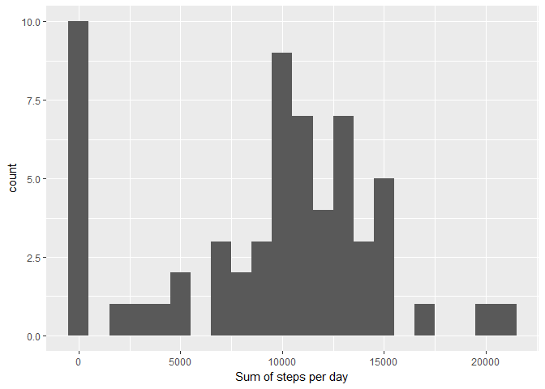
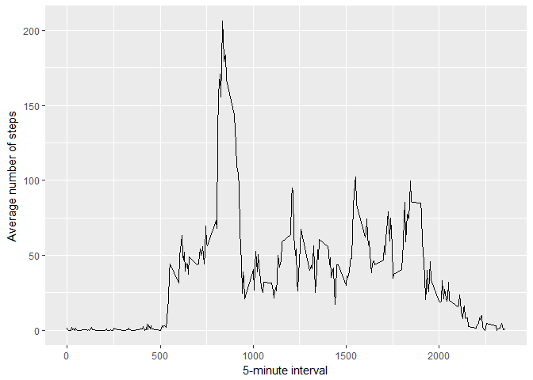
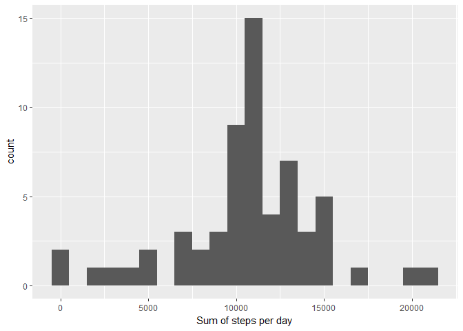

## Loading and preprocessing the data
1. Load the data (i.e. `read.csv()`).

```r
unzip(zipfile = "activity.zip")
data <- read.csv("activity.csv")
```


## What is mean total number of steps taken per day?
1. Calculate the total number of steps taken per day.
2. Make a histogram of the total number of steps taken each day.

```r
library("ggplot2"); library("dplyr")
data %>% group_by(date) %>% summarize(total = sum(steps, na.rm=TRUE)) -> total.steps
qplot(total.steps$total, binwidth = 1000, xlab = "Sum of steps per day")
```

<!-- -->


3. Calculate and report the mean and median of the total number of steps taken per day.

So, mean total number of steps taken per day is ***9354*** and median is ***10395*** :


```r
mean(total.steps$total, na.rm = TRUE)
```

```
## [1] 9354.23
```

```r
median(total.steps$total, na.rm = TRUE)
```

```
## [1] 10395
```


## What is the average daily activity pattern?
1. Make a time series plot (i.e. `type="l"`) of the 5-minute interval (x-axis) and the average number of steps taken, averaged across all days (y-axis)

```r
data %>% group_by(interval) %>% summarize(Mean = mean(steps, na.rm=TRUE)) -> avg
ggplot(avg, aes(x = interval, y = Mean)) + geom_line() + xlab("5-minute interval") + 
    ylab("Average number of steps")
```

<!-- -->

2. Which 5-minute interval, on average across all the days in the dataset, contains the maximum number of steps?

```r
avg[which.max(avg$Mean), ]
```

```
## # A tibble: 1 x 2
##   interval  Mean
##      <int> <dbl>
## 1      835  206.
```


## Imputing missing values
1. Calculate and report the total number of missing values in the dataset (i.e. the total number of rows with NAs).
Total number of missing values is **2304**.

```r
table(is.na(data))
```

```
## 
## FALSE  TRUE 
## 50400  2304
```

2. Devise a strategy for filling in all of the missing values in the dataset. The strategy does not need to be sophisticated. For example, you could use the mean/median for that day, or the mean for that 5-minute interval, etc.

To fill NA I used the mean of the 5-minute interval.

3. Create a new dataset that is equal to the original dataset but with the missing data filled in.

```r
for (i in 1:length(data$steps)){
  if (is.na(data$steps[i] == TRUE)){        
    data$steps[i] <- avg$Mean[data$interval[i] == avg$interval]
  } 
}

sum(is.na(data))
```

```
## [1] 0
```
4. Make a histogram of the total number of steps taken each day and Calculate and report the mean and median total number of steps taken per day. Do these values differ from the estimates from the first part of the assignment? What is the impact of imputing missing data on the estimates of the total daily number of steps?

```r
data %>% group_by(date) %>% summarize(total = sum(steps)) -> total.steps
qplot(total.steps$total, binwidth = 1000, xlab = "Sum of steps per day")
```

<!-- -->


```r
mean(total.steps$total, na.rm = TRUE)
```

```
## [1] 10766.19
```

```r
median(total.steps$total, na.rm = TRUE)
```

```
## [1] 10766.19
```

## Are there differences in activity patterns between weekdays and weekends?

```r
data$date <- as.Date(data$date)
data$day <- "weekday"
# sorry, i have russian locale :(
data$day <- ifelse(weekdays(data$date) == "суббота" | weekdays(data$date) == "воскресенье", "weekend", "weekday")
```

```r
avg <- aggregate(steps ~ interval + day, data = data, mean)
ggplot(avg, aes(interval, steps)) +
  geom_line() + facet_grid(day ~ .) +
  xlab("5-minute interval") + ylab("Number of steps")
```

<!-- -->

Yes, **there are** some differences in activity patterns between weekdays and weekends.


